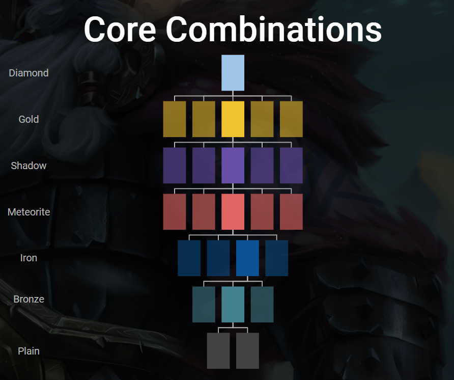

# Gods Unchained Fission
[Future of Blockchain Competition 2 Submission](https://medium.com/future-of-blockchain/prizes-and-challenges-future-of-blockchain-competition-40fe71bfe0ac)

[Powered by The Graph](http://thegraph.com/)

## Backstory
In the Gods Unchained trading card game there is The Forge. The Forge enables Fusion of cards. 5 cards of the same Proto and Quality can be fused in exchange for a more rare card Quality of the same Proto.

What if a player owns a high quality shadow, gold, or diamond proto? What if they are willing to exchange for a set of cards at a lower quality?

Introducing Unchained Games Fission. A reactor where cards can be split apart.

## How to Play?
This mini game involves two types of players. 

One type of player is **The Host**. The Host is a token holder with a higher quality card such as a shadow, gold, or diamond. The Host is willing to split their card for a set of lower quality cards of the same proto. The Host selects a card to split. The host also sets how many cards are required for Fission to split apart the card.

The other type of player owns a lower quality card such as a meteorite, shadow, or gold card. This player is interested to upgrade their lower Quality card for a higher Quality version of the same Proto.

## Gameplay Scenario

Alice owns a Shadow Avatar of War. Alice creates a new reaction pool requiring 6 Meteorite AoW tokens. A set of players each stake one or more Meteorite AoW tokens. Once a quorum of 6 shadow AoW tokens is reached, the reaction pool is activated. During the reaction, one of the 6 meteorite token holders is selected at random to receive the Shadow AoW. The Host receives the 6 meteorite tokens. The reaction is complete.

## Game Contract
https://etherscan.io/address/0x150c7856bea3b6cdcac0013dc3d6fa50fffaa35d

## Subgraph
https://thegraph.com/explorer/subgraph/unchainedgames/fission

## Demo
https://www.mythictitan.com/fission